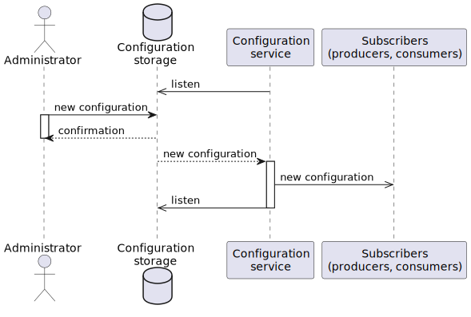
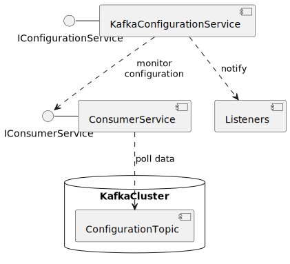

# Kafka Framework
This project enhances Kafka clients' functionality. 

## Project overview
- **Centralized Kafka clients configuration**: 
It provides a service that automatically updated Kafka clients' configuration. 
Sequence diagram 

- **Kafka based cache**: A key-value cache that stores data in Kafka. 
Sequence diagram 

- **Kafka consumer concurrent processing**: A mechanism to process records in parallel.  
Kafka built-in consumer group 

Alternative approach 

- **Robust Kafka producer**: A fault-tolerant producer with non-blocking sending.
It uses a local storage in order not to lose records. 
Sequence diagram 

## Implementation details
- **Centralized Kafka clients configuration** 
Components diagram 
 
Class diagram 

- **Kafka based cache** 
Class diagram 

- **Kafka consumer concurrent processing** 
Components diagram 
 
Class diagram 

- **Robust Kafka producer**: 
Components diagram 
 
Class diagram 

